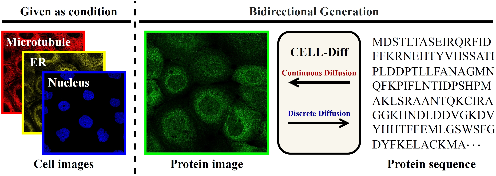

# CELL-Diff
CELL-Diff is a unified diffusion model designed to enable bidirectional transformations between protein sequences and microscopy images. By using cell morphology images as conditional inputs, CELL-Diff can generate protein images based on protein sequences. Conversely, it can generate protein sequences from microscopy images.


## Installation

To set up CELL-Diff, begin by creating a conda environment:
```shell
conda create --name cell_diff python=3.10
```

Activate the environment and run the installation script:
```shell
conda activate cell_diff
bash install.sh
```

## Pretrained Models

Download pretrained models:
```shell
aws s3 sync s3://czi-celldiff-public/v2/checkpoints/ ./pretrained_models --no-sign-request
```

## Protein Image Generation

### Human Protein Atlas Model: Generating Fixed Immunofluorescence Microscopy Protein Images from a Protein Sequence

1. Set `vae_loadcheck_path` and `loadcheck_path` in `run_hpa_image_generation.sh` (paths to the VAE model and CELL-Diff model).
2. Run:
```shell
bash run_hpa_image_generation.sh
```

### OpenCell Model: Generating Live Microscopy Protein Images from a Protein Sequence

1. Set `vae_loadcheck_path` and `loadcheck_path` in `run_opencell_image_generation.sh` (paths to the VAE model and CELL-Diff model).
2. Run:
```shell
bash run_opencell_image_generation.sh
```

### Validate Pretrained Model
Download the processed dataset:
```shell
aws s3 sync s3://czi-celldiff-public/v2/training-data/ ./processed_datasets --no-sign-request
```

Run evaluation:
1. Set `vae_loadcheck_path`, `loadcheck_path`, and `data_path` in `run_hpa_evaluation.sh` or `run_opencell_evaluation.sh` (paths to the VAE model, CELL-Diff model, and dataset).
2. Run:
```shell
bash run_hpa_evaluation.sh
bash run_opencell_evaluation.sh
```

## Protein Sequence Generation
To generate a protein sequence:
1. Set `vae_loadcheck_path` and `loadcheck_path` in `run_sequence_generation.sh` (paths to the VAE model and CELL-Diff model).
2. Run:
```shell
bash run_sequence_generation.sh
```

## Training

HPA pretraining:
1. Set `vae_loadcheck_path` and `data_path` in `run_hpa_pretrain.sh` (paths to the VAE model and dataset).
2. Run:
```shell
bash run_hpa_pretrain.sh
```

OpenCell finetuning:
1. Set `vae_loadcheck_path`, `loadcheck_path`, and `data_path` in `run_opencell_finetune.sh` (paths to the VAE model, pretrained CELL-Diff model, and dataset).
2. Run:
```shell
bash run_opencell_finetune.sh
```

## Download ALL data (checkpoints and datasets)
```shell
aws s3 sync s3://czi-celldiff-public/v2/ ./checkpoints_datasets --no-sign-request
```