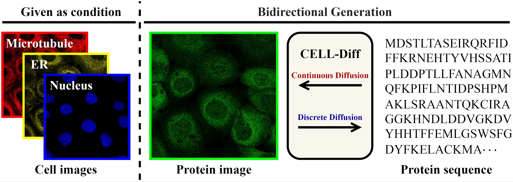

# CELL-Diff
CELL-Diff is a unified diffusion model designed to enable bidirectional transformations between protein sequences and microscopy images. By using cell morphology images as conditional inputs, CELL-Diff can generate protein images based on protein sequences. Conversely, it can generate protein sequences from microscopy images.


## Installation

To set up CELL-Diff, begin by creating a conda environment:
```shell
conda create --name cell_diff python=3.10
```

Activate the environment and run the installation script:
```shell
conda activate cell_diff
bash install.sh
```

## Pretrained Models

Download pretrained models from the following sources:
* [HPA trained model](https://drive.google.com/file/d/1vo8GDzLZU1QYy5p9IFR6jVr3zdE1m9Gy/view?usp=drive_link)
* [OpenCell trained model](https://drive.google.com/file/d/1DtvFxKRZHZMZKIX1HERbH83tQOtQQ9ZC/view?usp=drive_link)

## Protein Image Generation

### Human Protein Atlas Model: Generating Fixed Immunofluorescence Microscopy Protein Images from a Protein Sequence

To generate a protein image using a Linux shell, execute the following commands:
```shell
# Set the output directory
export save_dir='./output'

# Set the path for cell morphology images
# Available options: './data/hpa/1/', './data/hpa/2/', './data/hpa/3/', './data/hpa/4/', './data/hpa/5/'
export cell_morphology_image_path='./data/hpa/1/'

# Specify the target protein sequence (NPM1)
export test_sequence='MEDSMDMDMSPLRPQNYLFGCELKADKDYHFKVDNDENEHQLSLRTVSLGAGAKDELHIVEAEAMNYEGSPIKVTLATLKMSVQPTVSLGGFEITPPVVLRLKCGSGPVHISGQHLVAVEEDAESEDEEEEDVKLLSISGKRSAPGGGSKVPQKKVKLAADEDDDDDDEEDDDEDDDDDDFDDEEAEEKAPVKKSIRDTPAKNAQKSNQNGKDSKPSSTPRSKGQESFKKQEKTPKTPKGPSSVEDIKAKMQASIEKGGSLPKVEAKFINYVKNCFRMTDQEAIQDLWQWRKSL'

# Specify the path to the pretrained model weights
export loadcheck_path='./model_weights/hpa_checkpoint.pt'

# Set the random seed
export seed=6

# Run the image generation script
bash run_image_prediction_hpa.sh
```

### OpenCell Model: Generating Live Microscopy Protein Images from a Protein Sequence.

To generate a protein image using a Linux shell, execute the following commands:
```shell
# Set the output directory
export save_dir='./output'

# Set the path for cell morphology images
# Available options: './data/opencell/1/', './data/opencell/2/', './data/opencell/3/', './data/opencell/4/', './data/opencell/5/'
export cell_morphology_image_path='./data/opencell/1/'

# Specify the target protein sequence (NPM1)
export test_sequence='MEDSMDMDMSPLRPQNYLFGCELKADKDYHFKVDNDENEHQLSLRTVSLGAGAKDELHIVEAEAMNYEGSPIKVTLATLKMSVQPTVSLGGFEITPPVVLRLKCGSGPVHISGQHLVAVEEDAESEDEEEEDVKLLSISGKRSAPGGGSKVPQKKVKLAADEDDDDDDEEDDDEDDDDDDFDDEEAEEKAPVKKSIRDTPAKNAQKSNQNGKDSKPSSTPRSKGQESFKKQEKTPKTPKGPSSVEDIKAKMQASIEKGGSLPKVEAKFINYVKNCFRMTDQEAIQDLWQWRKSL'

# Specify the path to the pretrained model weights
export loadcheck_path='./model_weights/opencell_checkpoint.pt'

# Set the random
export seed=6

# Run the image generation script
bash run_image_prediction_opencell.sh
```